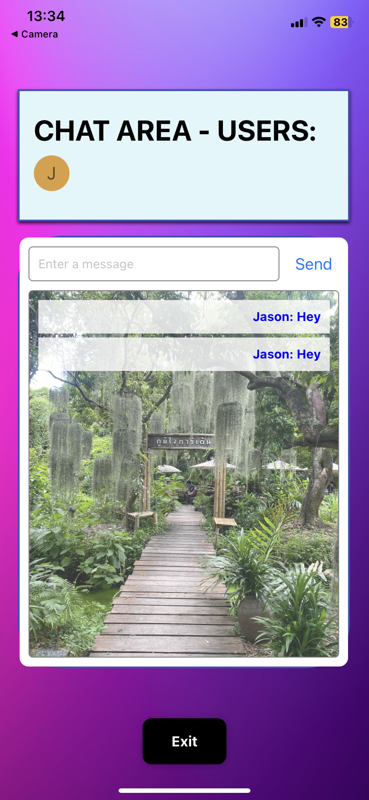

## Web Socket project with React, React Native

This is be a small project using web sockets, React Native and React

## Table of Contents
- [Web Socket project with React, React Native](#web-socket-project-with-react-react-native)
- [Table of Contents](#table-of-contents)
- [Project Overview](#project-overview)
- [Tech Stack](#tech-stack)
- [How to Use](#how-to-use)
- [Development Stages](#development-stages)
- [Screenshots](#screenshots)


## Project Overview
This is in preparation for SaaS I will be building. For this is a small chat app using React and React Native with Node.js as the backend.

The React app is just small basic app, no unit tests or typescript, the main focus is Node and React Native

NOTE - This uses Expo for React Native and has ONLY been tested for iOS use

## Tech Stack
- React
- Node
- React Native
- Expo
- Web Sockets
- REST API 

## How to Use
Step one - Clone\downlaod the repo.

Step two - Run the server locally
```bash
cd server
npm install
npm run dev // This will run the server on localhost 8000
```

Step three - Run the client on browser locally
```bash
cd react-client
npm install
npm start // This will run the client on localhost 3000
```

Step four - Run mobile from EXPO
```bash
cd mobile-ws
npm install
npm start // This will run Expo
```

Step 5 - Scan the QR from Expo and run on your iOS device
**IMPORTANT - To interact with your localhost server, YOU MUST amend the following URL with your localhost IP address**
```bash
// mobile-ws/utils/api.ts
export const WS_URL_DEV = 'ws://192.168.1.64:8000'; // change this to your EXPO IP addreess
```

Step 6 - On browser and phone
Login and enter then start sending messages via mobile and browser

## Development Stages
1. Set up basic server for web sockets and REST
   * Implemented? Yes
   * Pushed to Git? Yes
2. Set up basic client on React and test flow
   * Implemented? Yes
   * Pushed to Git? Yes 
3. Refactor client and UI
   * Implemented? Yes
   * Pushed to Git? Yes 
4. Set up proper chat display
   * Implemented? Yes
   * Pushed to Git? Yes 
5. Set up React Native client and test flow
   * Implemented? Yes
   * Pushed to Git? Yes 
6. Set up React Native client with login and connect to WS
   * Implemented? Yes
   * Pushed to Git? Yes 
7. Set up React Native client and display chat
   * Implemented? Yes
   * Pushed to Git? Yes 
8. Refactor React Native client and UI
   * Implemented? Yes
   * Pushed to Git? Yes 
9. Set up and test for Android

## Screenshots


