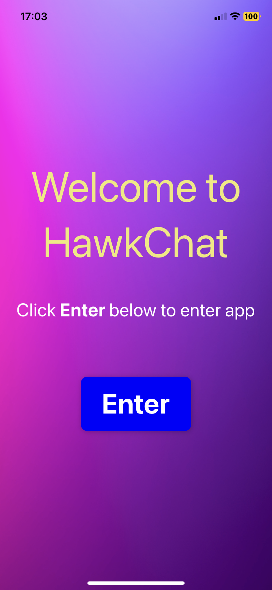

## Web Socket project with React, React Native

IN PROGRESS: This will be a small project using web sockets, React Native and React

## Table of Contents
- [Web Socket project with React, React Native](#web-socket-project-with-react-react-native)
- [Table of Contents](#table-of-contents)
- [Project Overview](#project-overview)
- [Tech Stack](#tech-stack)
- [Implementation Stages](#implementation-stages)
- [Screenshots](#screenshots)

## Project Overview
This is in preparation for SaaS I will be building. For this is a small chat app using React and React Native with Node.js as the backend.

The React app is just small basic app, no unit tests or typescript, the main focus is Node and React Native

## Tech Stack
- React
- Node
- React Native
- Web Sockets
- REST API 

## Implementation Stages
1. Set up basic server for web sockets and REST
   * Implemented? Yes
   * Pushed to Git? Yes
2. Set up basic client on React and test flow
   * Implemented? Yes
   * Pushed to Git? Yes 
3. Refactor client and UI
   * Implemented? Yes
   * Pushed to Git? Yes 
4. Set up proper chat display
   * Implemented? Yes
   * Pushed to Git? Yes 
5. Set up React Native client and test flow
   * Implemented? Yes
   * Pushed to Git? Yes 
6. Set up React Native client with login and connect to WS
7. Set up React Native client and display chat
8. Refactor React Native client and UI
9. Set up tab controller on RN
10. Build REST on server
11. Fetch data from REST for client and display
12. Fetch data from React Native for client and display

## Screenshots

