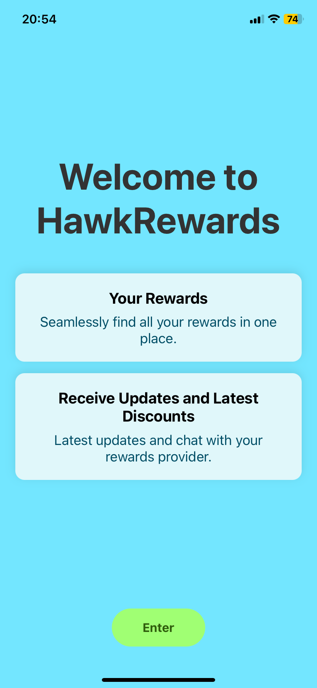

## Loyaly Program project with React, Node, React Native

This is small part of a bigger project and though not for use, here to show the early stages of the code.

In this project there will be a client side where vendors will add rewards. A user will then be able to scan this reward which will then appear in their React Native application.

A chat part of the application between the vendor and the user is initally set up.

## Table of Contents
- [Loyaly Program project with React, Node, React Native](#loyaly-program-project-with-react-node-react-native)
- [Table of Contents](#table-of-contents)
- [Project Overview](#project-overview)
- [Tech Stack](#tech-stack)
- [Development Stages](#development-stages)
- [Screenshots](#screenshots)

## Project Overview
This is in preparation for SaaS I am uilding. For this is an initial Chat application between the client and react native.

The React app client is just a basic app that will later form part of a bigger extension.

NOTE - This uses Expo for React Native and has ONLY been tested for iOS use

## Tech Stack
- React
- Node
- React Native
- Expo
- Web Sockets
- REST API
- MongoDB

## Development Stages
1. Phase 1 - Build inital stage - DONE
   * Set up Client, Server and React Native
   * Apply Web sockets and create basic chat between Client and React Native

2. Phase 2 - Implement REST API - DONE
   * Set up MongoDB and create initial basic RESTAPIs
   * Create default user, vendor and rewards for initial stage.
   * Fetch rewards specific for user

3. Phase 3 - Implement Vendor side - IN PROGRESS
   * Allow vendor to create reward
   * Allow vendor to list and update rewards
   * Implement QR scan for new user to claim reward and/or increase stampe

4. Phase 4 - Implement Mobile User side - NOT STARTED
   * Allow user to scan the QR to claim or increase reward stamps
   * Implement feature to see other Rewards by other vendors not scanned

5. Phase 5 - Implement other features for Mobile - NOT STARTED
   * Set up Profile screen and other screens

6. Phase 6 - Set up Auth, roles and middleware - NOT STARTED

7. Phase 7 - Set up Chat to be between vendor and user only - NOT STARTED

8. Phase 8 - Set up Vendor Dashboard properly - NOT STARTED

9. Phase 9 - Set up Admin Dashboard to manage Vendors and Users - NOT STARTED

10. Phase 10 - Set up site for SaaS - NOT STARTED

11. Phase 11 - Set up other parts of the workflow - NOT STARTED
   * Enable non mobile app users to be directed to app store 

12. Phase 12 - Set up CI/CD, test environments, Cloud infrastructure - NOT STARTED
   * Likely to start between phases 8 to 11

13. Phase 13 - Admin and Vendor changes - NOT STARTED 

14. Phase 14 - Backend, storage and DB changes - NOT STARTED

15. Phase 15 - Mobile changes - NOT STARTED

16. Phase 16 - Testing and deployment - NOT STARTED

## Screenshots

